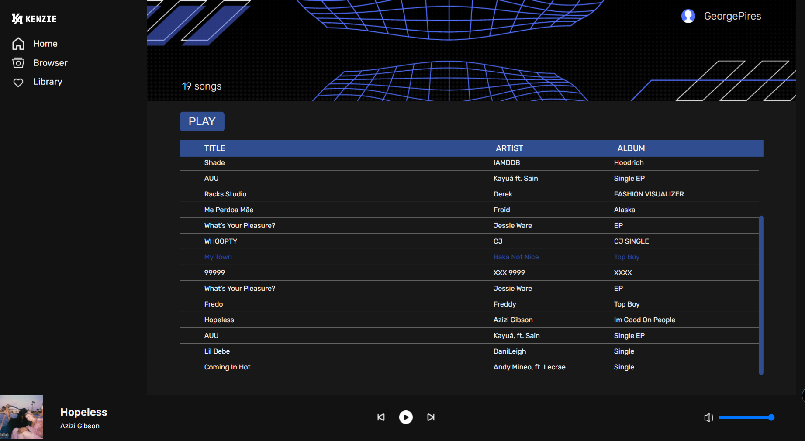

# Kenziefy
Projeto desenvolvido na IV Edicão da Maratona Zero ao Código, promovida pela Kenzie Academy Brasil.

 

  

## 🚀 Tecnologias

Esse projeto foi desenvolvido com as seguintes tecnologias:

 
  
  
  
  
 

---
